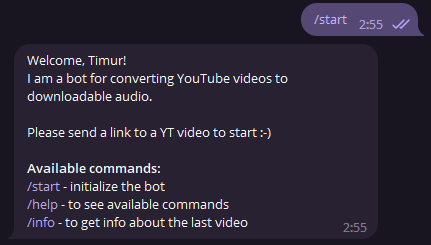

# YouTube to .mp3 Converter Telegram Bot
| develop                                                                                                                            | main                                                                                                                       |
|------------------------------------------------------------------------------------------------------------------------------------|---------------------------------------------------------------------------------------------------------------------------|
|  |  |
## Description
A bot for converting YouTube videos to mp3 audio

## Functionality

This bot receives a link to a YouTube video, converts it to an audio format and sends it to the user.
Possible inputs are:

- `/start` — let the bot greet you and bein the work:

  

- `/help` — see available commands:

  

- send a link to YouTube video - bot should get you your audio:

  

- `/info` — should get you the information about the video you last sent:

  

Any other input will be regarded as incorrect :-).

## Getting started

### Setting up credentials

First, you should provide your own [Telegram bot](https://t.me/BotFather)
token.

Once you got it, paste it to `TOKEN` variable in `config`.

### Running with Docker

First, build the image:

```
docker build -t yttg_bot .
```

Then, run the application:

```
docker run yttg_bot
```

### Running without Docker

First, clone this repository:
```
git clone https://github.com/iTteruya/youtube-to-mp3-telegram-bot.git
```
Then:
1. Install python 3.8.8 or newer
2. Install required libs `pip install -r requirements.txt`
3. Run the main file `python main.py`
